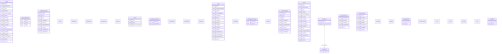

```mermaid
erDiagram
Activity {
    string about  
    string addProperties  
    string allow  
    string altLabel  
    string associatedMedia  
    string citation  
    string compute  
    string cronTable  
    string description  
    string messages  
    string order  
    string overrideProperties  
    string preamble  
    string prefLabel  
    string schemaVersion  
    string shuffle  
    string version  
}
AdditionalNoteObj {
    string column  
    string source  
    string value  
}
AdditionalProperty {
    string isAbout  
    string isVis  
    string limit  
    string maxRetakes  
    string prefLabel  
    string randomMaxDelay  
    string schedule  
    string valueRequired  
    string variableName  
}
Agent {

}
AllowExport {

}
AllowReplay {

}
AutoAdvance {

}
Boolean {

}
Choice {
    string name  
    string image  
    string value_from_schema  
}
ComputeSpecification {
    string jsExpression  
    string variableName  
}
CreativeWork {

}
DisableBack {

}
DontKnow {

}
Item {
    string about  
    string additionalNotesObj  
    string altLabel  
    string associatedMedia  
    string description  
    string image  
    string inputType  
    string isPartOf  
    string preamble  
    string prefLabel  
    string question  
    string readonlyValue  
    string responseOptions  
    string schemaVersion  
    string version  
}
LangString {

}
MessageSpecification {
    string jsExpression  
    string message  
}
Number {

}
OverrideProperty {
    string isAbout  
    string isVis  
    string limit  
    string maxRetakes  
    string prefLabel  
    string randomMaxDelay  
    string schedule  
    string valueRequired  
    string variableName  
}
Participant {
    string subject_id  
}
Protocol {
    string about  
    string addProperties  
    string allow  
    string altLabel  
    string associatedMedia  
    string compute  
    string cronTable  
    string description  
    string landingPage  
    string messages  
    string order  
    string overrideProperties  
    string prefLabel  
    string schemaVersion  
    string shuffle  
    string version  
}
Response {
    string isAbout  
    string value_from_schema  
}
ResponseActivity {
    string endedAtTime  
    string generated  
    string inLanguage  
    string startedAtTime  
    string used  
}
ResponseOption {
    string choices  
    string datumType  
    string maxValue  
    string minValue  
    string multipleChoice  
    string unitOptions  
    string valueType  
}
Schedule {

}
Skipped {

}
SoftwareAgent {
    string version  
    string url  
}
StructuredValue {

}
Text {

}
Thing {

}
TimedOut {

}
URL {

}
UnitOption {
    string prefLabel  
    string value  
}

Response ||--|o Participant : "wasAttributedTo"

```

