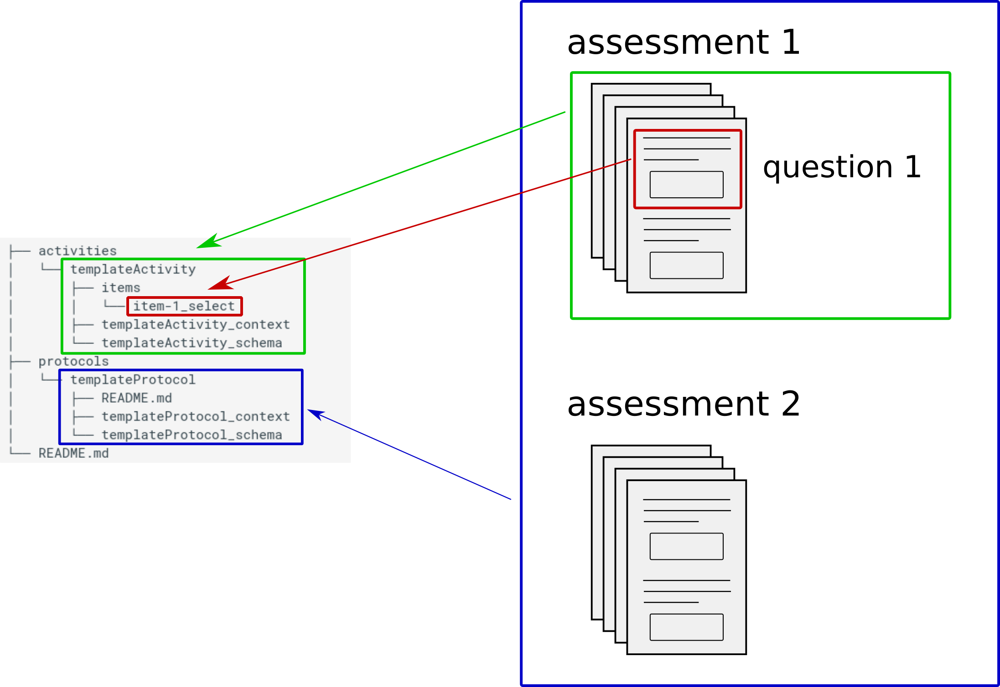

# The schema

## Overview

A simplistic way to describe the Reprochema is to say it is organized in a hierarchical manner with roughly 3 levels with a schema describing each level.

1.  The highest level is the `protocol` level that originally define a set of assessments or questionnaires to be
    included in a given study.
    This schema is defined by the [Protocol schema](https://raw.githubusercontent.com/ReproNim/reproschema/master/terms/Protocol).

1.  The second level is the `activity` level that describe a given questionnaire. This level would describe all the questions of this assessment: for example all the items of the Edinburgh handedness inventory would constitute one activity.
    This schema is defined by the [Activity schema](https://raw.githubusercontent.com/ReproNim/reproschema/master/terms/Activity).

1.  At a lower level we have the `item` level where each `item` represents a question from a given assessment.
    On top of containing the text of the actual question, the schema at this level can contain additional
    information such as the expected format of the item for the user interface: a boolean
    (if this is a yes/no question), a multiple choice (with a list of the response choices),
    a float or an integer (if a numerical value is expected)...
    This schema is defined by the [Field schema](https://raw.githubusercontent.com/ReproNim/reproschema/master/terms/Field).



You can see an example of those in the [examples folder](https://github.com/ReproNim/reproschema/tree/master/examples)

There are in fact more levels than this each and each level has its own schema:

-   all of the schemas can be found in the [`terms` folder](https://github.com/ReproNim/reproschema/tree/master/terms)
-   the Reproschema actually allows for a more complex level nesting than the one described above (e.g you can have an `activity` within an `activity`)
-   all the properties of each level are described below in the [Properties of ReproSchema objects section](#properties-of-reproschema-objects)

## Detailed description

The core model of ReproSchema was initially derived from the [CEDAR Metadata Model](https://more.metadatacenter.org/).
To accommodate the needs of neuroimaging and other clinical and behavioral
protocols and assessments the schema has evolved significantly. These changes
include:

1.  Alignment with [schema.org](https://schema.org) and [NIDM](https://nidm.nidash.org).
    We have used schema.org classes and properties where it maps on to the needs of
    the model and extended the model with NIDM elements to harmonize across ReproNim projects.

1.  Allowing for structured nested elements in a schema
   `Protocol > Activity > [Activity | Field > ResponseOption]`. This nested
   structure provides a flexible schema to represent nested activities, which are
   common in biomedical and other domains.

```text
Protocol
├── Activity
│   ├── Field
│   │   └── ResponseOption
│   └── Field
│   │   └── ResponseOption
│   ├── Activity
│   │   ├── Field
│   │   │   └── ResponseOption
│   │   ...
│   ...
├── Activity
│   ...
...
```

1.  Interaction with Git/Github or another Web service to deliver a new `protocol`,
    `ativity` or `field` with a persistent URI, while tracking changes associated with
    any of these elements. By making every `field` represented through a persistent URI,
    a data collection instrument can link the responses to the exact `field` that was
    used.

1.  Addition of computable elements that are derived from the values entered by a participant.

1.  Allowing for user interface (UI) elements that allow interaction between the schema
    and any implementation that allows collecting data using the schema. By providing
    some additional UI elements the provider can guide an implementer to allow for
    more complex data collection behavior.

The [ReproSchema-UI](https://repronim.org/reproschema-ui) is a prototype implementation of an UI that leverages these
different elements of the schema.

## ReproSchema Model

The model was written using a linked data modeling language [LinkML](https://linkml.io/linkml/).

There are multiple ways of accessing the content:

-  [The LinkML YAML file that defines the model](https://github.com/ReproNim/reproschema/blob/main/linkml-schema/reproschema.yaml)
-  [Automatically generated documentation](./doc-linkml-autogen/index.md) using LinkML tools
-  [Automatically generated Entity-Relationship (ER) Diagrams](./erdiagram-autogen.md)) to visualize the model.

The context was created semi-automatically: the initial version was generated using LinkML tools,
but manual curation was necessary to support all Reeproschema features.
